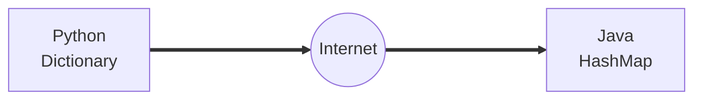
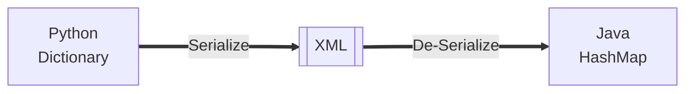
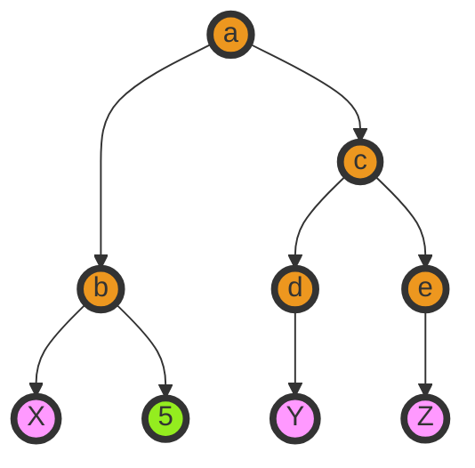

# <span style="color:#f6fc2d">Data on the Web</span>

- With the HTTP Request/Response well understood and well <br>
  supported, there was a natural move towards exchanging data<br>
  between programs using these protocols
- We needed to come up with an agreed way to represent data going<br>
  between applications and across networks
- There are two commonly used formats: XML and JSON

## <span style="color:#f6fc2d">Sending Data across the "Net"</span>



A.K.A "Wire Protocol" - What we send on the "wire"

## <span style="color:#f6fc2d">Agreeing on a "Wire Format"</span>



# <span style="color:#f6fc2d">eXtensible Markup Language (XML)</span>

## <span style="color:#f6fc2d">XML "Elements" (or Nodes)</span>

- Simple Element
- Complex Element

```xml
<people>
    <person>
        <!--Simple Element  -->
        <name>Chuck</name>
        <phone>303 4456</phone>
    </person>
    <!-- Complex Element -->
    <person>
        <name>Noah</name>
        <phone>622 7421</phone>
    </person>
</people>
```

## <span style="color:#f6fc2d">eXtensible Markup Language</span>

- Primary purpose is to help information systems <span style="color: #94ed1f">share structured data</span>
- It started as a simplified subset of the Standard Generalized Markup Language<br>
  (SGML), and is designed to be relatively human-legible

## <span style="color:#f6fc2d">XML Basics</span>

- start Tag
- End tag
- Text content
- Attribute
- Self closing Tag

```xml
<!-- start tag -->
<person>
    <name>
    <!-- text content -->
        Chuck
    </name>
    <!-- attribute -->
    <phone type="intl">
    +1 734 303 4456
    </phone>
    <!-- self closing tag -->
    <email hide="yes"/>
<!-- end tag -->
</person>
```

### <span style="color:#f6fc2d">White space</span>

Line ends do not matter. white space is generally discarded on<br>
text elements. We indent only to be readable

## <span style="color:#f6fc2d">XML Terminology</span>

- <span style="color: #94ed1f">Tags</span> indicate the beginning and ending of elements
- <span style="color:#ae1fd1">Attributes</span> - Keyword/value pairs on the opening tag of XML
- <span style="color:#ed971f">Serialize/ De-Serialize</span> - Convert data in one program into a common<br>
  format that cna be stored and/or transmitted between systems in a <br>
  programming language-independent manner

## <span style="color:#f6fc2d">XML as a Tree</span>

- <span style="color:#ed971f">Elements</span>
- <span style="color:#f9f">Text</span>
- <span style="color:#94ed1f">Attributes</span>

<table>
<tr>
<td>

```xml
<a>
    <b w="5">X</b>
    <c>
        <d>Y</d>
        <e>Z</e>
    </c>
</a>
```

</td>
<td>



</td>
</tr>
</table>

# <span style="color:#f6fc2d">XML Schema</span>

- Description of the <span style="color:#f6fc2d">legal format</span> of an XML document
- Expressed in terms of constraints on the structure and context of documents
- Often used to specify a "<span style="color:#f6fc2d">contract</span>" between systems - "My system will<br>
  only accept XML that conforms to this particular Schemas."
- If a particular piece of XML meets the specification of the Schema - it <br>
  is said to "<span style="color:#f6fc2d">validate</span>"

```xml
<!-- XML Document -->
<person>
  <lastname>Severance</lastname>
  <age>17</age>
  <dateborn>2001-04-17</dateborn>
</person>

```

```xml
<!-- XML Schema Contract -->
<xs:complexType name="person">
  <xs:sequence>
    <xs:element name="lastname" type"xs:string"/>
    <xs:element name="age" type"xs:integer"/>
    <xs:element name="dateborn" type"xs:date"/>
  </xs:sequence>
</xs:complexType>

```

## <span style="color:#f6fc2d">Many XML Schema Languages</span>

- Document Type Definition (<a href="http://en.wikipedia.org/wiki/Document_Type_Definition">DTD</a>)
- Standard Generalized Markup Language (<a href="http://en.wikipedia.org/wiki/SGML">SGML</a>)
- XML Schema for W3C - (<a href="http://en.wikipedia.org/wiki/XML_Schema_(W3C)">XSD</a>)

### <span style="color:#f6fc2d">XSD XML Schema (W3C)</span>

- We will focus on the World Wide Web Consortium (W3C) version
- It is often called "W3C Schema" because "Schema" is considered generic
- More commonly it is called XSD because the file name end in .xsd

# <span style="color:#f6fc2d">JavaScript Object Notation (JSON)</span>

- Douglas Crockford - "Discovered" JSON
- Object literal notation in JavaScript

# <span style="color:#f6fc2d">Service Oriented Approach</span>

- Most non-trivial web applications use services
- They use services from other applications
  - Credit card Charge
  - Hotel Reservation System
- Services publish the "rules" applications must<br>
  follow to make use of the service (<span style="color:#ed971f">API</span>)

## <span style="color:#f6fc2d">Multiple Systems</span>

- Initially - two systems cooperate and split the problem
- As the data/service become useful - multiple applications<br>
  to use the information / application

