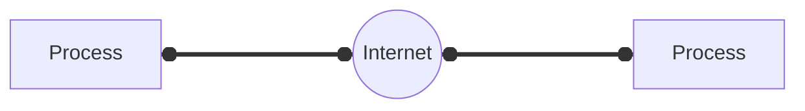

# <span style="color:#f6fc2d">Networked Technology</span>

## <span style="color:#f6fc2d">Transport Control Protocol (TCP)</span>

- Built on top of IP (Internet Protocol)
- Assumes IP might lose some data - stores and retransmits<br>
  data if it seems to be lost
- Handles "flow control" using a transmit window
- Provides a nice reliable <span style="color:#f6fc2d">pipe</span>

## Stack Connections


### TCP Connections <span style="color:#f6fc2d">/ Sockets</span>

"In computer networking, an Internet <span style="color:#f6fc2d">Socket</span> or network <span style="color:#f6fc2d">Socket</span> is <br>
an endpointof a bidirectional <span style="color:#34ebd2">inter-process</span> communication flow <br>
across an <span style="color:#b5473f">Internet</span> Protocol-based computer network, such as the <span style="color:#b5473f">Internet</span>"



### TCP <span style="color:#f6fc2d">Port Numbers</span>

- A port is an <span style="color: #94ed1f">application-specific</span> or process-specific <br>
  software communications endpoint
- It allows multiple networked applications to coexist on the <br>
  same server.
- There is a list of well-known TCP port numbers

http://www.clker.com/search/networksym/1

## <span style="color:#f6fc2d">Common TCP Ports</span>

| Port | Service/Application                     |
| ---- | --------------------------------------- |
| 21   | FTP (File Transfer Protocol)            |
| 22   | SSH (Secure Shell)                      |
| 23   | Telnet                                  |
| 25   | SMTP (Simple Mail Transfer Protocol)    |
| 53   | DNS (Domain Name System)                |
| 80   | HTTP (Hypertext Transfer Protocol)      |
| 109  | POP2 (Post Office Protocol 2)           |
| 110  | POP3 (Post Office Protocol 3)           |
| 143  | IMAP (Internet Message Access Protocol) |
| 220  | IMAPS (IMAP over TLS/SSL)               |
| 443  | HTTPS (HTTP Secure)                     |
| 993  | IMAPS (IMAP over TLS/SSL)               |

## <span style="color:#f6fc2d">Sockets in Python</span>

Python has built-in support for TCP Socket

```python
import socket
mysock = socket.socket(socket.AF_INET, socket.SOCK_STREAM)
#Host = data.r4e.org
#port = 80
mysock.connect(('data.pr43.org',80))
```


# <span style="color:#f6fc2d">Hypertext Transfer Protocol (HTTP)</span>

## <span style="color:#f6fc2d">Application Protocol</span>

- Since TCP (and python) gives us a reliable socket, what do we want to <br>
  do with the socket? What problem do we want to solve?
- Application Protocol
  - Mail
  - World Wide Web

## <span style="color:#f6fc2d">HTTP - Hypertext Transfer Protocol</span>

- The domainant Application Layer Protocol on the Internet
- Invented for the Web - to REtrieve HTML, Images, Documents, etc
- Extended to be data in addition to documents - RSS, Web Services, <br>
  etc.. Basic Concept - Make a Connection - Request a document- <br>
  Retrieve the Document - Close the connection

## <span style="color:#f6fc2d">HTTP - Hypertext Transfer Protocol</span>

- A set of rules that all parties follow so we can <br>
  predict each other's behavior
- And not bump into each other
  - On two-way roads in USA, drive on the <br>
    right-hand side of the road
  - On two-way roads in the UK, drive on <br>
    the left-hand side of the road

## <span style="color:#94ed1f">Getting Data From The Server</span>

Each the user clicks on an anchor tag with an href= value to switch to <br>
a new page, the browser makes a connection to the web server and <br>
issues a "GET" request - to GET the content of the page at the specified URL

The server returns the HTML document to the Browser which formats<br>
and displays the document to the user.

## <span style="color:#f6fc2d">Internet Standards</span>

- The standards for all of the Internet protocols (inner workings)<br>
  are developed by an organization
- Internet Engineering Task Force (IETF)
- WWW.ietf.org
- Standards are colled "RFCs" - "Request for Comments"

## <span style="color:#94ed1f">Making an HTTP request</span>

Connect to the server like <span style="color:#f6fc2d">www.dr-chuck.com</span>
Request a document (or the default document)

- <span style="color:#94ed1f">GET http://www.dr-chuck.com/page1.htm HTTP/1.0</span>
- <span style="color:#94ed1f">GET http://www.mlive.com/ann-arbor/ HTTP/1.0</span>
- <span style="color:#94ed1f">GET http://www.facebook.com HTTP/1.0</span>

<!-- http://nmap.org/movies.html -->

## <span style="color:#f6fc2d">An HTTP Request in Python</span>

```python
import socket
mysock = socket.socket(socket.AF_INET, socket.SOCK_STREAM)
mysock.connect(('data.pr4e.org',80))
cmd = 'GET http://data.pr4e.org/romeo.txt HTTP/1.0\r\n\r\n'.encode()
mysock.send(cmd)

while True:
    data = mysock.recv(512)
    if (len(data) < 1):
        break
    print(data.decode())
mysock.close()
```



# <span style="color:#f6fc2d">If You Want to Learn More</span>

This chapter covers networking at a very high leve. If you want to learn more, there is bothe free book and a Coursera<br>

```mermaid
flowchart LR

subgraph Your_program
  direction TB
  socket ===> N["S
  O
  C
  K
  E
  T"]
  connect ===> N
  send ===> N
  recv ===> N
end

N ==>|port 80| B[("www.py4e.com
Web Pages
")]
style Your_program fill:#4e4d4f,stroke:#333,stroke-width:4px
```

course that I would recomend:

- <a href="https://www.net-intro.com/">Introduction to Networking</a> (free textbook)
- <a href="https://www.coursera.org/learn/internet-history"> Internet History, Technology, and Security</a> (Coursera Course)

Neither of these is essential for this course or the python specialization as we quickly move from how the network<br>
works to how to write python code using the urllib library - which makes the very complex internet protocols <br>
exceedingly simple.

# <span style="color:#f6fc2d">Unicode Characters and Strings</span>

## <span style="color:#f6fc2d">Representing Simple Strings</span>

- Each character is represented by a number between 0 and 256<br>
  stored in 8 bits of memory
- We refer to "8 bits of meemory" as a <span style="color:#94ed1f">"byte"</span> of memory - (i.e. my disk<br>
  drive contains 3 Tera<span style="color:#94ed1f">bytes</span> of memory)
- The <span style="color:#ae1fd1">ord()</span> function tells us the numeric value of a simple ASCII character

In the 1960s and 1970s, we just assumed that one byte was one character

```python
>>> print(ord('H'))
72
>>> print(ord('e'))
101
>>> print(ord('\n'))
10
```

## <span style="color:#ed971f">Multi-Byte Character</span>

To represent the wide range of characters computers must handle we represent<br>
characters with more than one byte

- UTF-16 - Fixed length - Two bytes
- UTF-32 - Fixed length - Four bytes
- UTF-8 - 1-4 bytes
  - Upwards compatible with ASCII
  - Automatic detection between ASCII and UTF-8
  - <span style="color:#94ed1f">UTF-8 is recommended practice for encoding<br>
    data to be exchanged between systems</span>


## <span style="color:#f6fc2d">Python 3 and Unicode</span>

In python 3, all strings internally are UNICODE

Working with string variables in python programs and reading data from <br>
usually "just works" when we talk to a network resource using sockets or <br>
talk to a database we have to encode and decode data (usually to UTF-8)

```python
>>> x = b'abc'
>>> type(x)
<class 'bytes'>
>>> x = '안녕'
>>> type(x)
<class 'str'>
>>> x = u'안녕'
>>> type(x)
<clss 'str'>
```

## <span style="color:#f6fc2d">Python Strings to Bytes</span>

- When we talk to an external resource like a network socket we sends bytes,<br>
  so we need to encode python 3 strings into a given character encoding
- When we read data from an extrnal resource, we must decode it based on <br>
  the character set so it is properly represented in python 3 as a string

```python
while True:
  data = sysock.recv(512)
  if(len(data)<1):
    break
  mystring = data.decode()
  print(mystring)
```

# <span style="color:#f6fc2d">Retrieving web pages</span>

## <span style="color:#f6fc2d">Using urllib in python</span>

Since HTTP is so common, we have a library that does all the socket<br>
work for us and makes web pages look like a file

```python
import urllib.request, urllib.parse, urllib.error

fhand = urllib.request.urlopen('http://data.pr4e.org/romeo.txt')
for line in fhand:
  print(line.decode().strip())
```

# <span style="color:#f6fc2d">Parsing web pages</span>

## <span style="color:#f6fc2d">What is web scraping?</span>

- When a program or script pretends to be a browser and retrieves<br>
  web pages, looks at those web pages, extracts information, and<br>
  then looks at more web pages
- Search engines scrape web pages - we call this "spidering the web"<br>
  or "web crawling"

### <span style="color:#f6fc2d">Why Scrape?</span>

- Pull data - particularly social data - who links to who?
- Get your own data back out of some system that has no "export capability"
- Monitor a site for new information
- Spider the web to make a database for search engine

### <span style="color:#f6fc2d">Scraping web pages</span>

- There is some controversy about web page scraping and some <br>
  sites are a bit snippy about it.
- Republishing copyrighted informaion is not allowed
- Violating terms of service is not allowed

### <span style="color:#f6fc2d">The Easy Way - Beautiful soup</span>

- YOu could do string searches the hard way
- Or use the free software library colled <a href="https://www.crummy.com/software/BeautifulSoup/">BeautifullSoup</a>

### <span style="color:#f6fc2d">Summary</span>
- The TCP/IP gives us pipes/ sockets between applications
- We designed application protocols to make use of these pipes
- HyperText Transfer protocol (HTTP) is a simple yet powerful protocol
- Python has good support for sockets, HTTP , and HTML parsing

