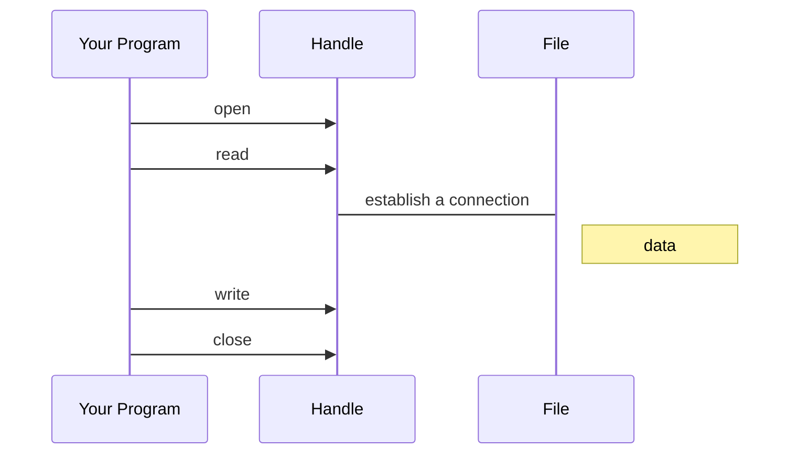

# <span style="color:#f6fc2d">Files</span>

## <span style="color:#f6fc2d">File Processing</span>

A text file can be thought of as a sequence of lines

<span style="color:#ae1fd1">From stephen.marquard@uct.ac.za Sat Jan 5 09:14:16 2008<br>
Return-Path: &lt;Postmaster@collab.sakaiproject.org&gt;<br>
Data: Sat, 5 Jan 2008 09:12:18 -0500<br>
To: source@collab.sakaiproject.org<br>
From: stephen.marquard@uct.ac.za<br>
Subject: [sakai] svn commit: r39772 - content/branches/<br>
<br>
Details: http://source.sakaiproject.org/viewsvn/?view=rev&rev=39772</span>

### <span style="color:#f6fc2d">Opening a File</span>

- Before we can read the contents of the file, we must tell Python<br>
  which file we are going to work with and what we will be doing with<br>
  the file
- This is done with the <span style="color:#ae1fd1">open()</span> function
- <span style="color:#ae1fd1">open()</span> return a "<span style="color:#ed971f">file handle</span>" - a variable used to perform operations<br>
  on the file
- Similar to "File -> Open" in a Word Processor

#### <span style="color:#f6fc2d">Using open()</span>

- <span style="color:#ed971f">handle</span> = <span style="color:#ae1fd1">open</span>(<span style="color:#34ebd2">filename</span>,<span style="color:#f6fc2d">mode</span>)
- <span style="color:#ed971f">returns a handle use to manipulate the file</span>
- <span style="color:#34ebd2">filename is a string</span>
- <span style="color:#f6fc2d"> mode is optional and should be 'r' if we are planning<br>
  to read the file and 'w' if we are going to write to the file</span>

#### <span style="color:#f6fc2d">What is a Handle?</span>



### <span style="color:#f6fc2d">The newline Character</span>

- We use a special character called the "<span style="color:#34ebd2">newline</span>" to indicate <br>
  when a line ends
- We represent it as <span style="color:#34ebd2">\n</span> in strings
- <span style="color:#34ebd2">Newline</span> is still one character - not two

```python
>>> stuff = "Hello\nWorld!"
>>> stuff
'Hello\nWorld!'
>>> print(stuff)
Hello
World!
>>> stuff = 'x\ny'
>>> print(stuff)
x
y
>>> len(stuff)
3
```

# <span style="color:#f6fc2d">Processing Files</span>

## <span style="color:#f6fc2d">File Handle as a Sequence</span>

- A <span style="color:#ed971f">file handle</span> open for read can be treated as a <span style="color:#34ebd2">sequence</span> of<br>
  strings where each line in the file is a string in the sequence
- We can use the for statement to iterate through a <span style="color:#34ebd2">sequence</span>
- Remember - a <span style="color:#34ebd2">sequence</span> is an ordered set

```python
xfile = open('mbox.txt', 'r')
for line in xfile:
    print(line)
xfile.close()
```

### <span style="color:#f6fc2d">Counting Lines in a File</span>

- Open a file read-only
- Use a for loop to read each line
- Count the lines and print out the number of lines

<table>
<tr>
<th>Code</th>
<th>Output</th>
</tr>
<tr>
<td>

```python
fhand = open("mbox.txt", "r")
count = 0
for line in fhand:
    count = count + 1
print("Line Count:",count)
fhand.close()
```

</td>
<td>

```python
$ python open.py
Line Count: 132045
```

</td>
</tr>
</table>

### <span style="color:#f6fc2d">Reading the \*Whole\* File</span>

We can read the whole file (newlines and all) into a single string

```python
>>> fhand = open('mbox-short.txt')
>>> inp = fhand.read()
>>>print(len(inp))
94626
>>> print(inp[:20])
From stephen.marquar
```

### <span style="color:#f6fc2d">Searching Through a File</span>

We can put an <span style="color:#f6fc2d">if</span> statement in our <span style="color:#f6fc2d">for</span> loop to only print<br>
lines that meet some criteria

```python
fhand = open('mbox-short.txt')
for line in fhand:
    if line.startswith('From:'):
        line = line.rstrip()
        print(line)
fhand.close()
```

### <span style="color:#f6fc2d">Prompt for File Name</span>

<table>
<tr>
<th>Code</th>
<th>Output</th>
</tr>
<tr>
<td>

```python
fname = input("Enter the file name: ")
fhand = open(fname)
count = 0
for line in fhand:
    if line.startswith('Subject:'):
        count = count + 1
print("There Were",count,"subject lines in",fname)
fhand.close()
```

</td>
<td>

```
Enter the file name: mbox.txt
There were 1797 subject lines in mbox.txt

Enter the file name: mbox-short.txt
There were 27 subjects lines in mbox-short.txt

```

</td>
</tr>
</table>

#### <span style="color:#f6fc2d">Bad File Names</span>

<table>
<tr>
<th>Code</th>
<th>Output</th>
</tr>
<tr>
<td>

```python
fname = input("Enter the file name: ")
try:
    fhand = open(fname)
except:
    print("File cannot be opened:",fname)
    quiet()
count = 0
for line in fhand:
    if line.startswith('Subject:'):
        count = count + 1
print("There Were",count,"subject lines in",fname)
fhand.close()
```

</td>
<td>

```
Enter the file name: mbox.txt
There were 1797 subject lines in mbox.txt

Enter the file name: na na boo boo
File cannot be opened: na na boo boo

```

</td>
</tr>
</table>
