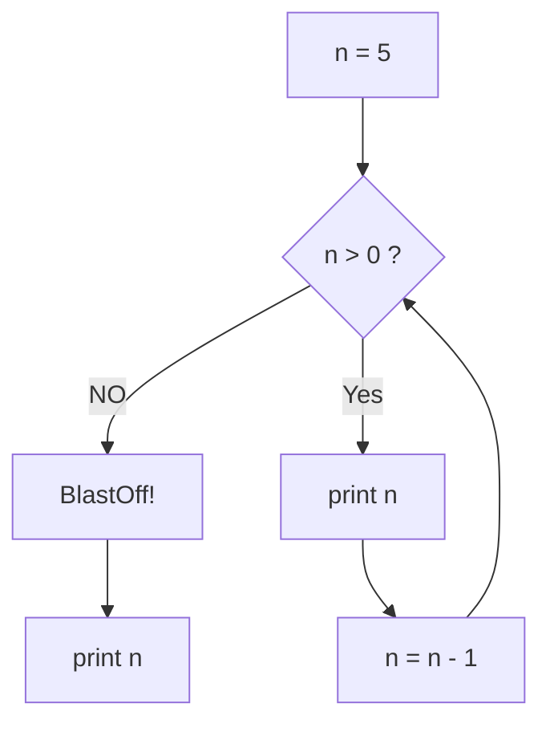
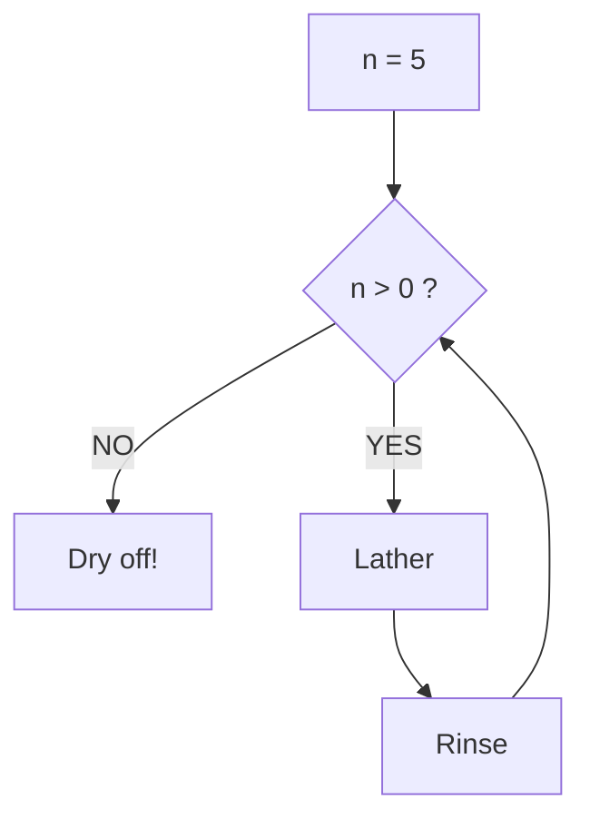
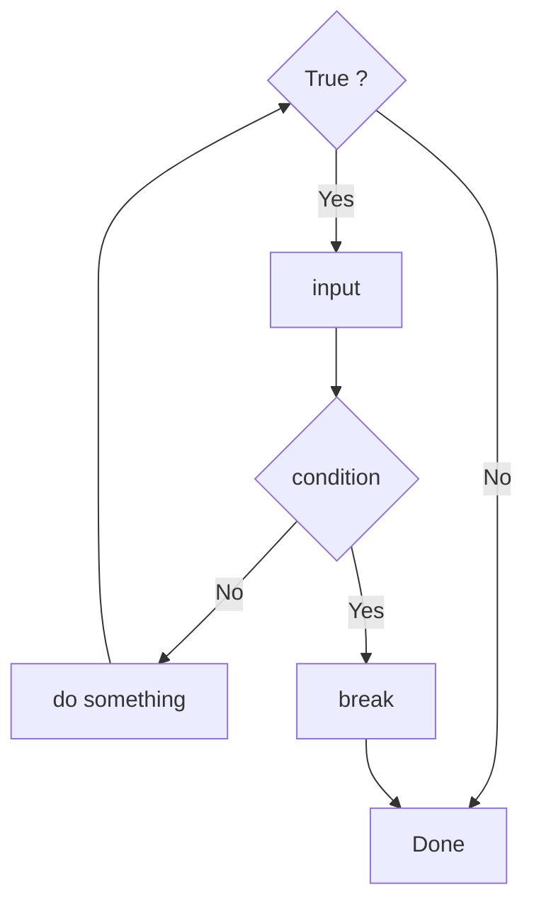
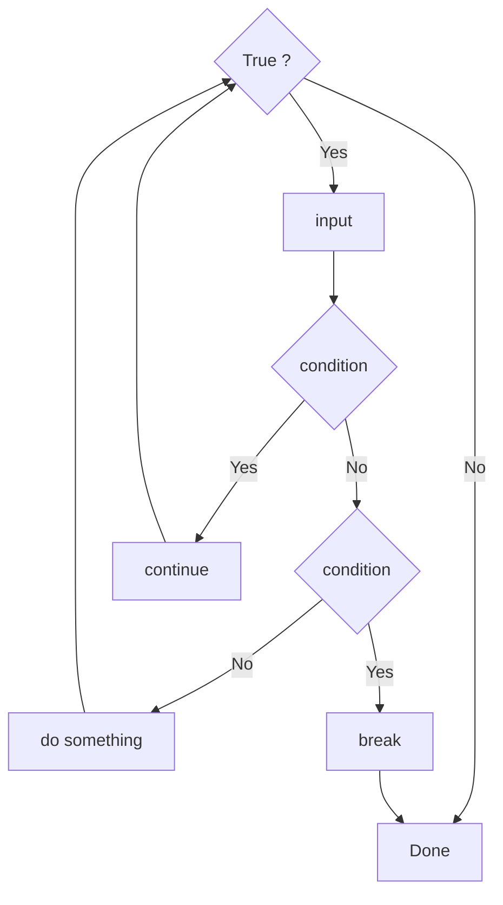
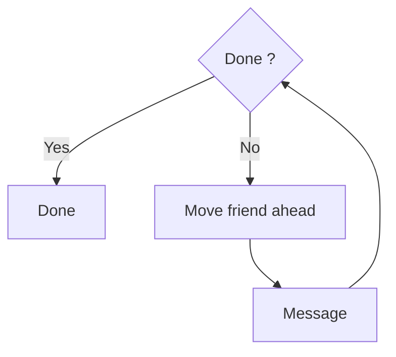
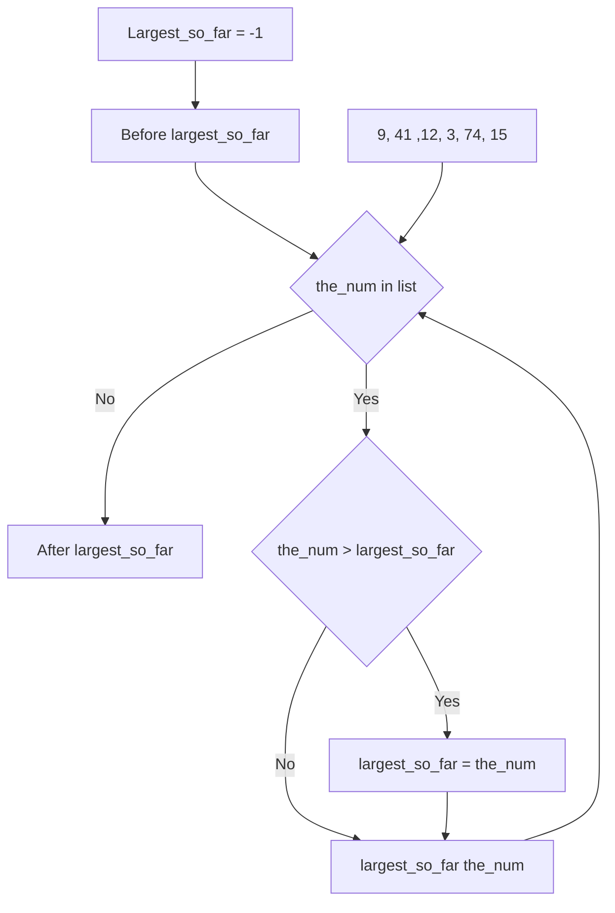
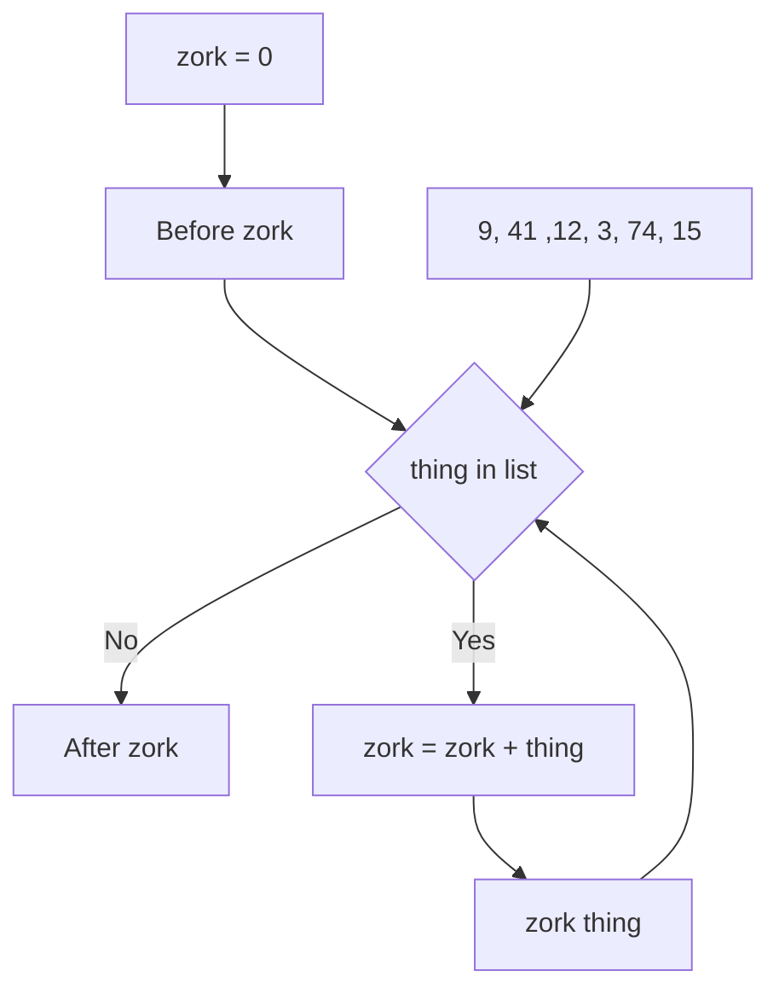
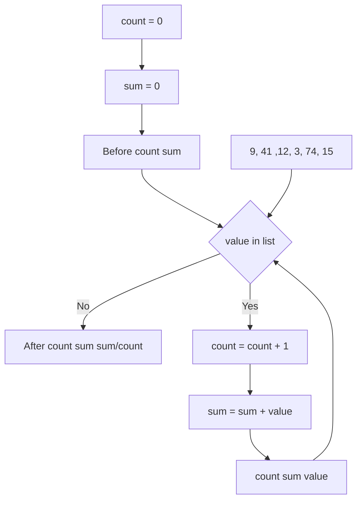
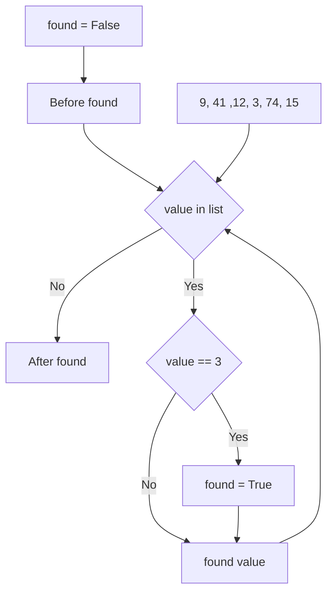
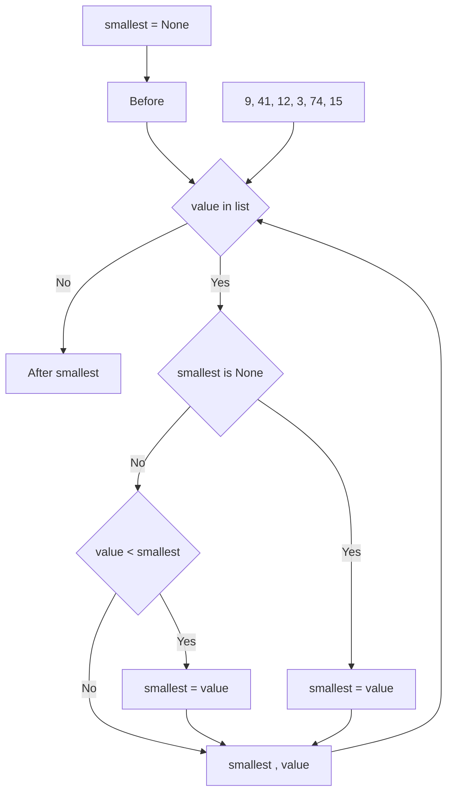

# <span style="color:#f6fc2d">Repeated Steps </span>

Loops (repeated steps) have <span style="color: #94ed1f">Iteration variables</span> that change each time<br>
through a loop. Often these <span style="color: #94ed1f"> iteration variables</span> go through a sequence<br>
of numbers

<table>
<tr>
<th>Code</th>
<th>Output</th>
<th>Flow</th>
</tr>
<tr>
<td>

```python
n = 5
while n > 0:
    print(n)
    n = n - 1
print("Blastoff!")
print(n)
```

</td>
<td>

```
5
4
3
2
1
Blastoff!
0
```

</td>
<td>



</td>
</tr>
</table>

# <span style="color:#f6fc2d">An Infinite Loop </span>

<span style="color: #94ed1f"> What is wrong with this loop?</span>

<table>
<tr>
<th> Code </th>
<th> Flow </th>
</tr>
<tr>
<td>

```python
#Infinite loop
n = 5
while n > 0 :
    print("Lather")
    print("Rinse")
print("Dry off!")
```

</td>
<td>



</td>
</tr>
<tr>
<td>

```python
# Zero-trip loop
n = 0
while n > 0 :
    print("Lather")
    print("Rinse")
print("Dry off!")
```

</td>
<td>


</td>
</tr>

</table>

# <span style="color:#f6fc2d">Breaking Out of a Loop</span>

- The <span style="color:#f6fc2d">break</span> statement ends the current loop and jumps to the<br>
  statement immediately following the loop
- It is like a loop test that can happen anywhere in the body of the loop

<table>
<tr>
<th>Code</th>
<th>output</th>
<th>Flow</th>
</tr>
<tr>
<td>

```python
while True:
    line = input("> ")
    if line == "done":
        break
    print (line)
print("Done!")
```

</td>
<td>

```
> hello there
hello there
> finished
finished
> done
Done!
```

</td>
<td>



</td>
</tr>
</table>

# <span style="color:#f6fc2d">Finishing an Iteration with Continue</span>

The <span style="color:#f6fc2d">Continue</span> statement ends the current iteration and jumps to the<br>
top of the loop starts the next iteration

<table>
<tr>
<th>Code</th>
<th>Output</th>
<th>Flow</th>
</tr>
<tr>
<td>

```python
while True:
    line = input("> ")
    if line[0] =="#":
        continue
    if line == "done":
        break
    print(line)
print("Done!")
```

</td>
<td>

```
> hello there
hello there
> #don't print this
> print this!
print this!
> done
Done!
```

</td>
<td>



</td>
</tr>
</table>

# <span style="color:#f6fc2d">A Simple Definite Loop</span>

Definite loops (for loops) have explicit <span style="color: #94ed1f">Iteration variables</span> that change each time<br>
through a loop. These <span style="color: #94ed1f">Iteration variables</span> move through the sequence of set.

<table>
<tr>
<th>Code</th>
<th>Output</th>
<th>Flow</th>
</tr>
<tr>
<td>

```python
friends = ["Joseph", "Glenn", "Sally"]
for friend in friends:
    print("Happy New Year:", friend)
print("Done!")
```

</td>
<td>

```
Happy New Year: Joseph
Happy New Year: Glenn
Happy New Year: Sally

Done!
```

</td>
<td>



</td>
</tr>
</table>

## <span style="color: #f6fc2d">Looking at In...</span>

- The <span style="color: #94ed1f">Iteration variables</span> "iterates" through the<br>
  <span style="color:#ed971f">sequence</span> (order set)
- The <span style="color:#ae1fd1"> block (body)</span> of code is executed once for<br>
  each value in the <span style="color:#ed971f">sequence</span>
- The <span style="color: #94ed1f">Iteration variables</span> moves through all of the <br>
  values in the <span style="color:#ed971f">sequence</span>

### <span style="color:#f6fc2d">Finding the Largest Value</span>

We make a variable that contains the largest value we have seen so far. If the current<br>
<span style="color: #ae1fd1">number we are looking at</span> is large, it is the new <span style="color: #94ed1f">largest value we have seen so far.</span>

<table>
<tr>
<th>Code</th>
<th>Output</th>
<th>Flow</th>
</tr>
<tr>
<td>

```python
largest_so_far = -1
print("Before",largest_so_far)
for the_num in [9,41,12,3,74,15]:
    if the_num > largest_so_far:
        largest_so_far = the_num
    print(largest_so_far ,"  ",the_num)
print("After",largest_so_far)
```

</td>
<td>

```
$ python largest.py
Before -1
9 9
41 41
41 12
41 3
74 74
74 15
After 74
```

</td>
<td>



</td>
</tr>
</table>

### <span style="color:#f6fc2d">Summing in a Loop</span>

To <span style="color: #94ed1f">add</span> up a <span style="color:#34ebd2">value</span> we encounter in a loop, we introduce a <span style="color: #94ed1f">sum variable that</span><br>
<span style="color: #94ed1f">starts at 0</span> and we add the <span style="color:#34ebd2">value</span> to sum each time through the loop.

<table>
<tr>
<th>Code</th>
<th>Output</th>
<th>Flow</th>
</tr>
<tr>
<td>

```python
zork = 0
print("Before",zork)
for thing in [9, 41, 12, 3, 74, 15]:
    zork = zork + thing
    print(zork, thing)
print("After",zork)
```

</td>
<td>

```
$ python largest.py
Before 0
9 9
50 41
62 12
65 3
139 74
154 15
After 154
```

</td>
<td>



</td>
</tr>
</table>

### <span style="color:#f6fc2d">Finding the Average in a Loop</span>

An <span style="color:#f6fc2d">average</span> just combines the <span style="color:#34ebd2">counting</span> and <span style="color: #94ed1f">sum</span> patterns<br>
and <span style="color:#f6fc2d">divides when the loop is done.</span>

<table>
<tr>
<th>Code</th>
<th>Output</th>
<th>Flow</th>
</tr>
<tr>
<td>

```python
count = 0
sum = 0
print("Before",count,sum)
for value in [9, 41, 12, 3, 74, 15]:
    count = count + 1
    sum = sum + value
    print(count, sum , value)
print("After", count, sum, sum/count)
```

</td>
<td>

```
$ python averageloop.py
Before 0 0
1 9 9
2 50 41
3 62 12
4 65 3
5 139 74
6 154 15
After 6 154 25
```

</td>
<td>



</td>
</tr>
</table>

### <span style="color:#f6fc2d">Search Using a Boolean Variable</span>

If we just want to search and <span style="color: #94ed1f">know if a value was found</span>, we use a <span style="color: #94ed1f">variable</span> that <br>
starts at<span style="color:#f6fc2d">False</span> and is set to <span style="color:#f6fc2d">True</span> as soon as we <span style="color: #94ed1f">find</span> what we are looking for.

<table>
<tr>
<th>Code</th>
<th>Output</th>
<th>Flow</th>
</tr>
<tr>
<td>

```python
found = False
print("Before", found)
for value in [9, 41, 12, 3, 74, 15]:
    if value == 3:
        found = True
    print(found, value)
print("After", found)
```

</td>
<td>

```
$ python search.py
Before False
False 9
False 41
False 12
True 3
True 74
True 15
After True
```

</td>
<td>



</td>
</tr>
</table>

### <span style="color:#f6fc2d">Finding the Smallest Value</span>

We still have a variable that is the <span style="color: #94ed1f">smallest</span> so far. The first time through the loop <br>
<span style="color: #94ed1f">smallest</span> is <span style="color:#f6fc2d">None</span>, so we take the first <span style="color: #ae1fd1">value</span> to be the <span style="color: #94ed1f">smallest</span>.

<table>
<tr>
<th>Code</th>
<th>Output</th>
<th>Flow</th>
</tr>
<tr>
<td>

```python
smallest = None
print("Before")
for value in [9 ,41, 12, 3, 74, 15]:
    if smallest is None:
        smallest = value
    elif value < smallest:
        smallest = value
    print(smallest, value)
print("After",smallest)
```

</td>
<td>

```
$ python largest.py
Before
9 9
9 41
9 12
3 3
3 74
3 15
After 3
```

</td>
<td>



</td>
</tr>
</table>
