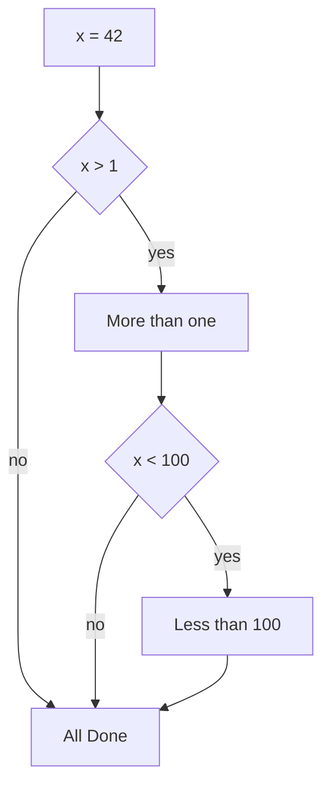
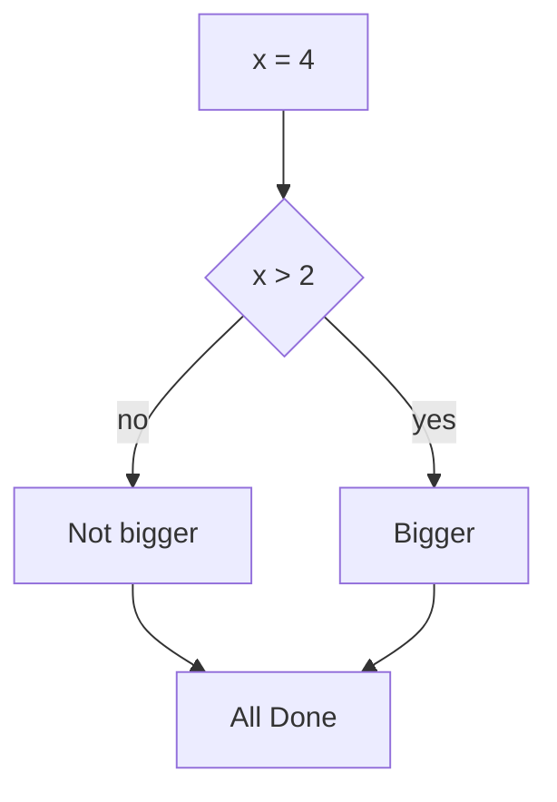
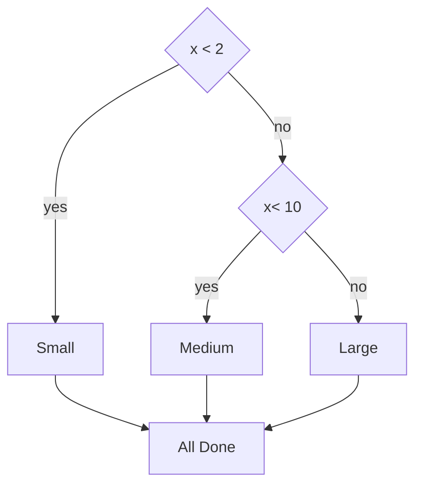

# Conditional Steps

```python
x = 5
if x < 10:
    print("smaller")
if x > 20:
    print("Bigger")
print("Finished")
```

# Comparision Operators

- <span style="color: #f6fc2d;">Boolean expressions</span> ask a question<br>
  and produce a Yes or No result which<br>
  we use to control program flow
- <span style="color: #f6fc2d;">Boolean expressions</span> using<br>
  <span style="color: #34c6eb;">comparison operators</span> evaluate to <br>
  True / False or Yes / No
- Comparison operators look at<br>
  variables but do not change the<br>
  variables

| Operator | Description              |
| -------- | ------------------------ |
| `==`     | Equal to                 |
| `!=`     | Not equal to             |
| `>`      | Greater than             |
| `<`      | Less than                |
| `>=`     | Greater than or equal to |
| `<=`     | Less than or equal to    |

# <span style="color: #f6fc2d;">Warning:</span> <span style="color:#ed411f">Turn Off Tabs!!</span>

Atom automatically uses spaces for files with ".py" extension (nice!)

- Most text editors can trun <span style="color:#ed971f ">tabs</span> into <span style="color:#94ed1f">spaces</span> - make sure to enable this feature
  - NotePad++: Settings -> Preferences -> Language Menu/<span style="color:#ed971f">Tab</span> Settings
  - TextWrangler: TextWrangler -> Preferences -> Editor Default
- Python cares a **lot** about how far a line is indented. If you mix <span style="color:#ed971f">tabs</span> and
  <span style="color:#94ed1f">spaces</span>, you may get "<span style="color:#ed971f">indentation errors</span>" even if everything looks fine

# Nested Decisions

<table>
<tr>
<td>

```python
x = 42
if x > 1 :
    print("More than one")
    if x < 100:
        print("Less than 100")
print("All done")
```

</td>
<td>



</td>
</tr>
</table>

## Two-way Decisions

- Somtimes we want to do one thing if a<br>
  logical expression is true and something <br>
  else if the expression is false
- It is like a fork in the road - we must choose<br>
  <span style="color:#f6fc2d">one or the other</span> path<br>
  but not both



## Multi-way

<table>
<tr>
<td>

```python
if x < 2:
    print("small")
elif x < 10:
    print("medium")
else:
    print("Large")
print("All Done")

```

</td>
<td>
    

</td>
</tr>
</table>

# <span style="color:#f6fc2d"> The try/except Structure </span>

- You surround a dangerous section of code with <span style="color:#ed971f ">try</span> into <span style="color:#94ed1f">except</span>
- If the code in the <span style="color:#ed971f ">try</span> works - the <span style="color:#94ed1f">except</span> is skipped
- If the code in the <span style="color:#ed971f ">try</span> fails - it jumps to the <span style="color:#94ed1f">except</span> section

<table>
<tr>
<td>

```python
rawstr = input("Enter a number: ")
try:
    ival = int(rawstr)
except:
    ival = -1
if ival > 0:
    print("Nice work")
else:
    print("Not a number")
```

</td>
<td>

```
$ python tryexcept.py
Enter a number: 42
Nice work

$ python tryexcept.py
Enter a number: forty-two
Not a number
```

</td>
</tr>
</table>
