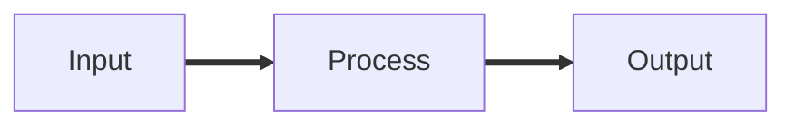
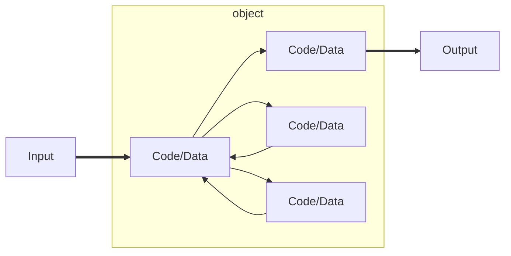

# Welcome to Using Databases with Python

# Object Oriented Definitions and Terminology

## Warning

- This lecture is very much about definitions and mechanics for objects
- This lecture is a lot more about "how it works" and less about "how you use it"
- You won't get the entire picture until this is all looked at in the context of a real problem
- So please suspend disbelief and learn technique

## Lets Start with Programs

## Object

- An Object is a bit of self-contained Code and Data
- A key aspect of the Object approach is to break the problem into 
  smaller understandable parts (divide and conquer)
- Objects have boundaries that allow us to ignore un-needed detail
- We have been using objects all along: String Objects, Integer Objects, 
  Dictionary Objects, List Objects...

## Definitions

- Class - a template
- Method or Message - A defined capability of a class
- Field or attribute - A bit of data in a class
- Object or Instance - A particular instance of a class

### Terminology: Class

Defines the abstract characteristics of a thing (object), including the 
thing's characteristics (its attributes, fields or properties) and the 
thing's behaviors (the things it can do, or methods, operations or 
features). One might say that a class is a blueprint or factory that 
describes the nature of something. For example, the class Dog would 
consist of traits shared by all dogs, such as breed and fur color 
(characteristics), and the ability to bark and sit (behavior)

### Terminology: Instance

One can have an instance of a class or a particular object. 
The instance is the actual object created at runtime. In 
programmer jargon, the Lassie object is an instance of the 
Dog class. The set of values of the attributes of a particular  
object is called its state. The object consists of state and the  
behavior that's defined in the object's class.

Object and instance are often used interchangeably

### Terminology: Method

An object's abilities. In language, Method ae verbs. Lassie, being a 
Dog's has the ability to bark. So bark() is one of Lassie's methods. 
She may have other Method as well, for example sit() or eat() or 
walk() or save_timmy(). Within the program, using a Method usually  
affects only one particular object; all Dogs can bark, but you need 
only one particular dog to do the barking

Method and Message are often used interchangeably

# Object Lifecycle

- Objects are created, used and discarded
- We have special blocks of code (methods) that get called
  - At the moment of creation (constructor)
  - At the moment of destruction (destructor)
- Constructors are used a lot
- Destructors are seldom used

## Constructor

- The primary purpose of the constructor is to set up some instance variables 
  to have the proper initial values when the object is created
- In Object oriented programming, a constructor in a class is a special block 
  of statements called when an object is created

## Many Instances

- We can create lots of objects - th class is the template for the object
- We can store each distinct object in its own variable
- We call this having multiple instances of the same class
- Each instance has its own copy ot the instance variables

Constructors can have additional parameters. These can be used to set up  
instance variables for the particular instance of the class (i.e., for the particular object)

# Object Inheritance

- When we make a new class - we can reuse an existing  
  class and inherit all the capabilities of an existing class and 
  then add our own little bit to make our new class
- Another form of store and reuse
- Write once - reuse many times
- The new class (child) has all the capabilities of the old class 
  (parent) - and then some more

### Terminology: Inheritance

"Subclasses" are more specialized versions of a class, which  
inherit attributes and behaviors from their parent classes, and 
can introduce their own
